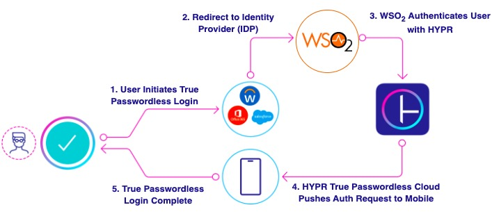

# HYPR Authenticator

User credentials and other shared secrets are under attack because bad actors find it easier to steal passwords 
and log in to systems than it is to hack in. Another problem with passwords is that they can be hard to remember 
for legitimate users and easy to steal and exploit by credential harvesters and other bad actors. Leveraging 
passwordless multi-factor authentication such as HYPR for users will help to eliminate passwords and deliver 
lightning-fast login experiences. Therefore, this HYPR Authenticator which is configured as a federated authenticator
in WSO2 Identity Server will let a user authorize an authentication request using a dedicated mobile device along with 
providing a secure and convenient passwordless multi-factor authentication flow. 
Once the authorization is provided at the device end, a request will be sent to the WSO2 Identity Server to 
authenticate the user into the service they are attempting to access.

You can use HYPR authenticator to authenticate HYPR users to sign in to your organization’s applications. 
This connector supports for WSO2 IS from version 6.0.0 and later.

The following diagram illustrates the authentication flow of the HYPR federated authenticator:

## Getting started
To get started with the authenticator, go to [Configuring the HYPR Authenticator](config.md).
Once you have completed your configurations, you can authenticate users using the HYPR Authenticator.

## Technical workflow
To understand the underlying flow of HYPR Authenticator, go to the
[Technical workflow of HYPR Authenticator](technicalworkflow.md)